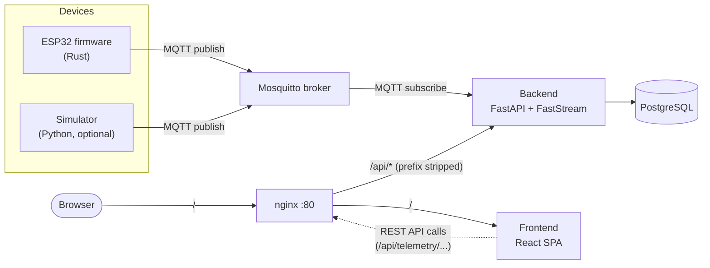

# Stolonet

Stolonet is an IoT soil and plant monitoring platform. ESP32 sensor nodes (or a
Python simulator standing in for real hardware) publish soil moisture and air
temperature readings over MQTT; a FastAPI backend ingests and stores that
telemetry in PostgreSQL and serves it over a REST API; a React dashboard polls
the API and displays live and historical readings.

## Tech stack

**Backend** — `backend/`
- Python 3.13, [FastAPI](https://fastapi.tiangolo.com/) for the HTTP API
- [SQLAlchemy 2](https://www.sqlalchemy.org/) (async) + `psycopg3` for PostgreSQL access, [Alembic](https://alembic.sqlalchemy.org/) for migrations
- [Dishka](https://github.com/reagento/dishka) for dependency injection
- [FastStream](https://faststream.airt.ai/) (MQTT transport) for telemetry ingestion
- Pydantic v2 for validation/settings, [uv](https://docs.astral.sh/uv/) for packaging
- ruff, mypy, pytest for linting/type-checking/testing

**Frontend** — `frontend/`
- React 19 + TypeScript, built with [Vite](https://vite.dev/)
- Tailwind CSS 4 for styling
- TanStack Query for data fetching/caching, Axios for HTTP

**Firmware** — `firmware/esp32-node/`
- Rust, targeting a real ESP32 device via `esp-idf-svc` + `embassy`
- Reads a BME280 sensor (temperature) and an ADC soil-moisture probe, publishes over MQTT

**Simulator** — `simulator/`
- Python, MQTT client — a stand-in for physical firmware for local development
  and testing, publishing randomized readings for multiple fake nodes

**Infrastructure**
- nginx — single public reverse-proxy entrypoint
- Mosquitto — MQTT broker
- PostgreSQL 18
- Docker Compose — orchestrates all services

## Architecture



Every sensor node — real firmware or the simulator — publishes to the topic
`stolonet/telemetry/<node_id>`, matching the payload defined in
[`contracts/telemetry.schema.json`](contracts/telemetry.schema.json). The
backend's FastStream MQTT subscriber listens on `stolonet/telemetry/+`,
validates each message against that contract, and persists it to Postgres. The
same backend process also serves the REST API that the frontend consumes: the
React app (running in the browser) calls `/api/telemetry/*` via TanStack
Query/Axios, which nginx proxies through to the backend (dashed line in the
diagram above).

### Backend: hexagonal architecture

The backend (`backend/src/stolonet/`) follows a ports-and-adapters layout:

```
domain/          # pure business logic — no framework dependencies
  models/          Reading, Telemetry, MetricAverage, ...
  interfaces/      Protocols (ports): repositories, use cases
application/     # use case implementations, orchestrating domain + ports
  usecases/        SaveTelemetryData, ReadTelemetryData, CalcAverageMetricValue
infrastructure/  # outbound adapters implementing domain ports
  persistence/     SQLAlchemy models, repository implementation, migrations
api/             # inbound HTTP adapter (FastAPI router)
ingest/          # inbound MQTT adapter (FastStream subscriber)
bootstrap/       # composition root — Dishka DI wiring ports to adapters, config, entrypoint
```

The `domain` layer defines *ports* as Python `Protocol`s (e.g.
`ReadingRepository`) with no dependency on FastAPI, SQLAlchemy, or MQTT. The
`infrastructure` and `ingest`/`api` layers are *adapters* that implement or
call those ports. `bootstrap/di` wires concrete adapters to ports via Dishka
providers, so the domain and application layers stay testable in isolation
from the database and message broker.

### Routing: `/api` vs `/`

nginx (`nginx/app.conf`) is the single entrypoint on port 80:

- `location /` proxies to the frontend's static file server.
- `location /api/` proxies to the backend with the `/api/` prefix **stripped**
  (`proxy_pass http://backend/;`, trailing slash). The FastAPI app's own
  routes are unprefixed (e.g. `/telemetry/{node_id}`), so a request to
  `/api/telemetry/{node_id}` from the browser reaches the backend as
  `/telemetry/{node_id}`.

When `API_DEBUG=true`, interactive API docs are available at `/api/docs` and
`/api/redoc`.

## Project structure

```
backend/                # FastAPI backend (hexagonal architecture, see above)
frontend/                # React + TypeScript dashboard
firmware/esp32-node/     # Rust firmware for the physical ESP32 sensor node
simulator/               # Python MQTT telemetry simulator (dev/test only)
contracts/               # Shared JSON schema for the MQTT telemetry payload
nginx/                   # Reverse proxy config (Dockerfile + app.conf)
mosquitto/                # MQTT broker config
postgres/                 # Postgres data volume (bind mount, not source)
docker-compose.yml        # Orchestrates all services
Justfile                  # Dev task runner
```

## API endpoints

All paths below are relative to `/api` as seen from the browser/client.

| Method | Path | Description |
| --- | --- | --- |
| `GET` | `/telemetry/{node_id}?metric_type=&hours=&limit=` | Historical readings for a node and metric |
| `GET` | `/telemetry/{node_id}/average?metric_type=&hours=` | Average metric value over a time window |

`metric_type` is one of the values defined in `MetricType`
(e.g. `soil_moisture`, `air_temperature`).

## Getting started

Prerequisites: Docker and Docker Compose.

1. Copy the environment file templates:
   ```bash
   cp .env.example .env
   cp backend/.env.example backend/.env
   cp frontend/.env.example frontend/.env
   ```
   Note: the frontend's env values are baked in at Docker build time, not read
   at container runtime.

2. Start the stack:
   ```bash
   docker compose up --build
   ```
   This starts PostgreSQL, the Mosquitto broker, the backend, the frontend,
   and nginx.

3. Open [http://localhost](http://localhost). nginx routes `/` to the
   frontend and `/api/*` to the backend.

### Using the simulator instead of real hardware

If you don't have ESP32 hardware, run the simulator to publish fake telemetry:

```bash
cp simulator/.enx.example simulator/.env   # note: template filename has a typo
docker compose --profile simulation up --build
```

The simulator publishes random readings for several fake nodes over MQTT,
exercising the same ingestion path as real firmware.

### Directly exposed ports (for local debugging)

| Service | Port |
| --- | --- |
| nginx (main entrypoint) | 80 |
| Backend | 8000 |
| Frontend | 8080 |
| PostgreSQL | 5432 |
| Mosquitto | 1883 |

## Development workflow

Common tasks are defined in the root `Justfile`:

```bash
just backend_format    # ruff format, ruff check --fix, mypy (backend/)
just backend_test       # pytest tests/unit -v (backend/)
just backend_migrate    # alembic upgrade head (backend/)
just pre-commit          # pre-commit run --all-files
```

CI (`.github/workflows/ci.yml`) runs ruff, mypy, and pytest against the
backend on every push/PR. Frontend, firmware, and simulator are not currently
covered by CI.

## Contracts

[`contracts/telemetry.schema.json`](contracts/telemetry.schema.json) defines
the canonical shape of an MQTT telemetry payload (node ID, timestamp, and a
list of readings with metric/value/unit). Firmware, the simulator, and the
backend all publish or consume payloads matching this schema.
